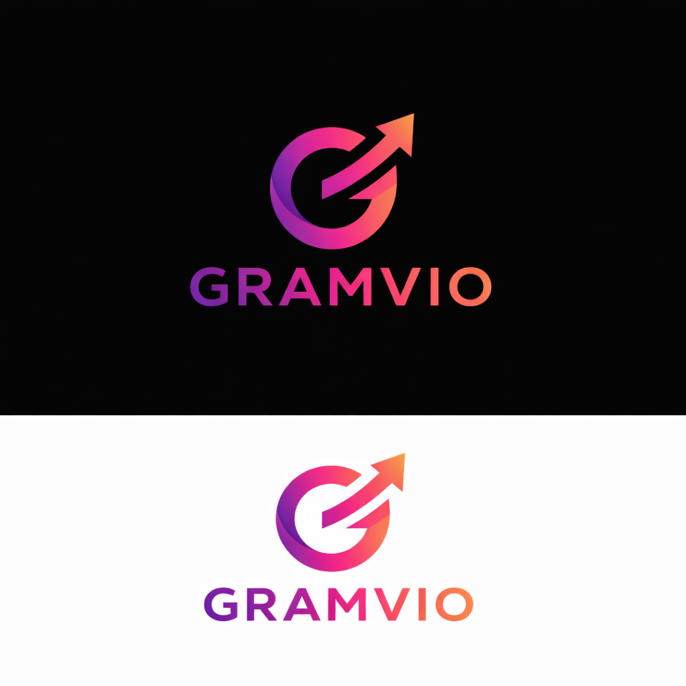

<!DOCTYPE html>
<html lang="en">
<head>
  <meta charset="UTF-8">
  <meta name="viewport" content="width=device-width, initial-scale=1.0">
  <title>GRAMVIO - Instagram Followers Growth</title>
  
</head>
<body>

<header>
  
  <nav>
    <a href="#home">Home</a>
    <a href="#pricing">Pricing</a>
    <a href="#payment">Payment</a>
  </nav>
</header>

<section id="home">
  

    <h2>Grow Your Instagram</h2>
    
Enter your details below to get started:

    <form id="orderForm">
      <label>Name</label>
      <input type="text" placeholder="Enter your name" required>

      <label>Instagram Username</label>
      <input type="text" placeholder="@yourusername" required>

      <label>Mobile Number</label>
      <input type="tel" placeholder="Enter mobile number" required>

      <label>Instagram Followers Range</label>
      <select required>
        <option value="">Select followers range</option>
        <option value="1K-5K">1K - 5K</option>
        <option value="5K-10K">5K - 10K</option>
        <option value="10K-25K">10K - 25K</option>
        <option value="25K-50K">25K - 50K</option>
        <option value="50K-100K">50K - 100K</option>
        <option value="100K+">100K+</option>
      </select>

      <button type="submit">Order Now on WhatsApp</button>
    </form>
  

</section>

<section id="pricing">
  

    <h3>Pricing</h3>
    
<strong>1K Instagram Followers – ₹25</strong>

    
Fast delivery • No password required • Safe & secure

  

</section>

<section id="payment">
  

    <h2>Payment Methods</h2>
    
Complete your payment using any method below and send screenshot on WhatsApp:

    <ul>
      <li><strong>UPI:</strong> yourupi@bank</li>
      <li><strong>PhonePe:</strong> +91 XXXXX XXXXX</li>
      <li><strong>Google Pay:</strong> +91 XXXXX XXXXX</li>
    </ul>
    
<em>After payment, delivery starts within minutes.</em>

  

</section>

<footer>
  
© 2026 GRAMVIO. All rights reserved.

</footer>

</body>
</html>

